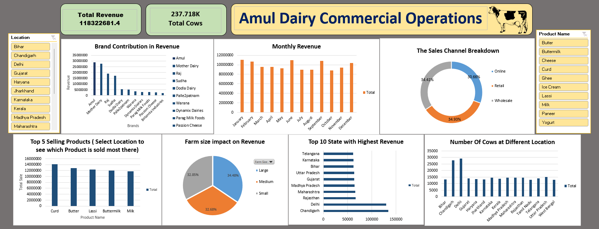

# Amul Dairy - Operations & Revenue Intelligence Hub

An end-to-end business intelligence and data engineering project tracking supply chain efficiency, distribution channel penetration, and financial revenue outcomes for Amul Dairy. This project utilizes a hybrid data pipeline approach: leveraging **Python** for structural data cleaning and preprocessing, and **Advanced Excel** for feature engineering, data modeling, and dynamic dashboard architecture.

📊 **Dataset Source:** [Kaggle Dairy Production Dataset](https://www.kaggle.com/datasets/debarghamitraroy/dairy-production-dataset)

---

## 🖥️ Live Dashboard Preview

Below is the interactive executive interface engineered to track over $118M+ in localized commercial operations. 

---

## 🛠️ Data Pipeline & Architecture

To prepare the dataset for executive-level reporting, the data underwent a two-stage transformation process across Python and Excel.

### Stage 1: Macro Cleaning & Preprocessing (Python)
Using `pandas` and `numpy` inside the `data_cleaning.ipynb` notebook, the raw transactional data was structurally standardized:
* **Column Normalization:** Stripped accidental leading/trailing spaces from all dataset column headers to prevent calculation syntax errors.
* **Temporal Alignment:** Converted absolute timestamp fields (`Date`, `Production Date`, and `Expiration Date`) into localized, machine-readable datetime objects.
* **Robust Imputation:** Handled structural missing values within critical stock thresholds safely by applying statistical median imputation to protect against data skewing.
* **Algorithmic Validation:** Engineered a raw `Calculated_Revenue` validation check by vectorizing quantity sold against unit pricing metrics.

### Stage 2: Advanced Feature Engineering & Modeling (Excel)
Once the base dataset was structurally sound, the data was brought into Excel for deep analytical transformations:
* **Time-Series Extraction:** Built localized date-part tracking helper columns using string and text manipulation formulas (such as `=TEXT(E6, "mmm")`) to isolate months and days of the week for time-series trend profiling.
* **Financial Localization Formatting:** Applied strict financial currency groupings and numerical formatting rules to convert messy raw decimals into reader-friendly executive metrics (e.g., standardizing the central Revenue KPI).
* **Multi-Dimensional Aggregation:** Built 9 separate operational Pivot Tables across dedicated back-end schemas to cross-tabulate categories, regions, and farm attributes.

---

## 📈 Executive Insights Delivered

The final dashboard layout delivers a 360-degree look at corporate health across 9 key analytical points:
1. **Brand Revenue Contribution:** Identifies top-performing manufacturing brands via prioritized column models.
2. **Monthly Revenue Trends:** A continuous line chart capturing temporal growth patterns over the fiscal calendar.
3. **Distribution Composition:** A modern donut visual tracking physical product volume split by sales channels.
4. **Top 5 VIP Products:** Isolates high-velocity products using strict value-filtering rules.
5. **Supply Chain Segmentation:** Tracks the percentage of organizational revenue derived from Small, Medium, and Large farms.
6. **Geographic Performance Index:** A sorted horizontal ranking of the Top 10 revenue-generating states.
7. **Asset Utilization Tracking:** A dual-axis combo chart cross-referencing total livestock counts alongside regional geographic boundaries.
8. **Interactive Slicer Controls:** Fully synchronized cross-filtering slicers allowing users to slice the entire reporting ecosystem by Location and Product line instantaneously.
